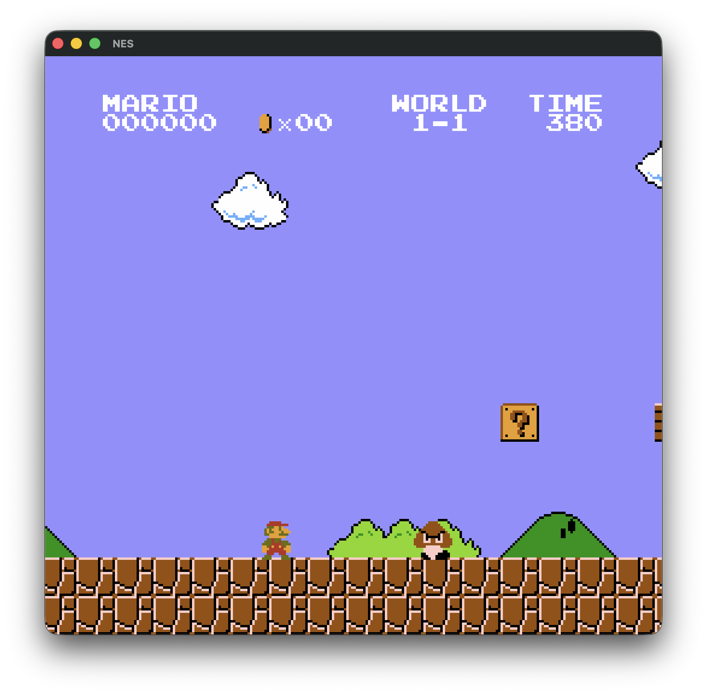
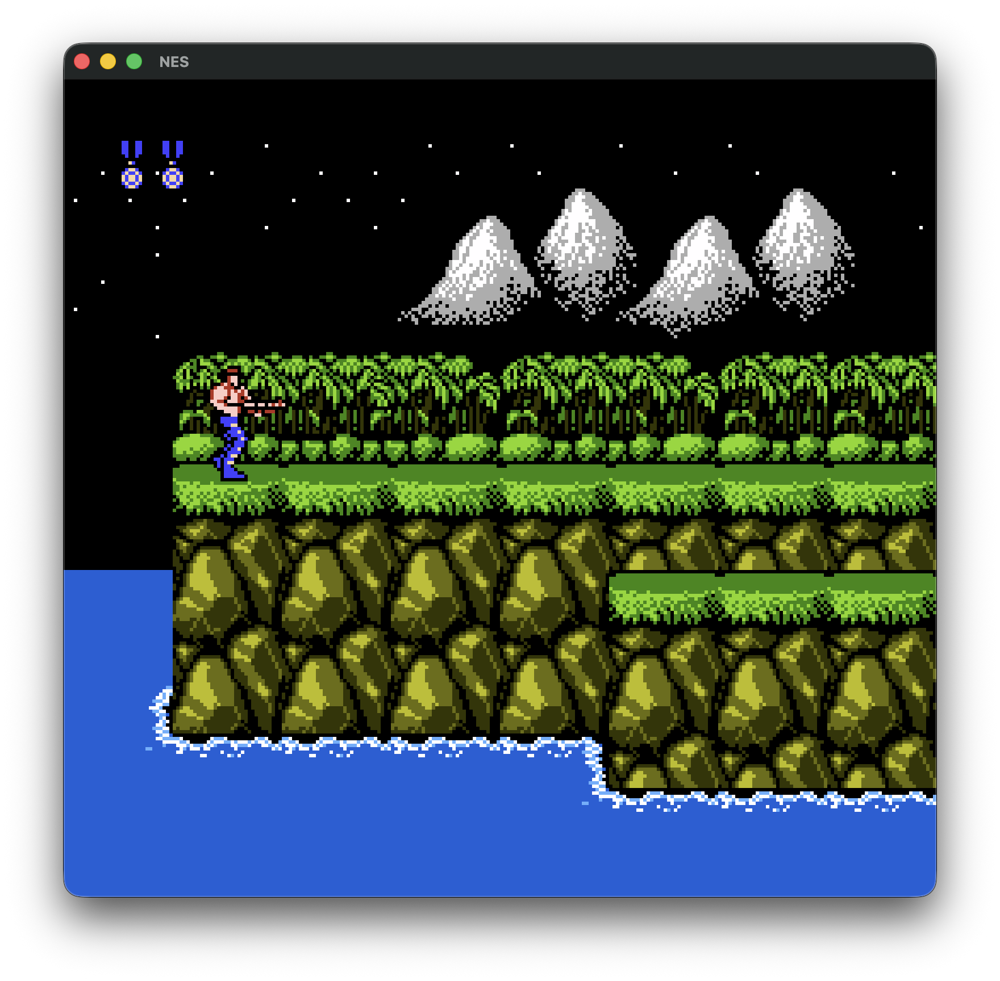
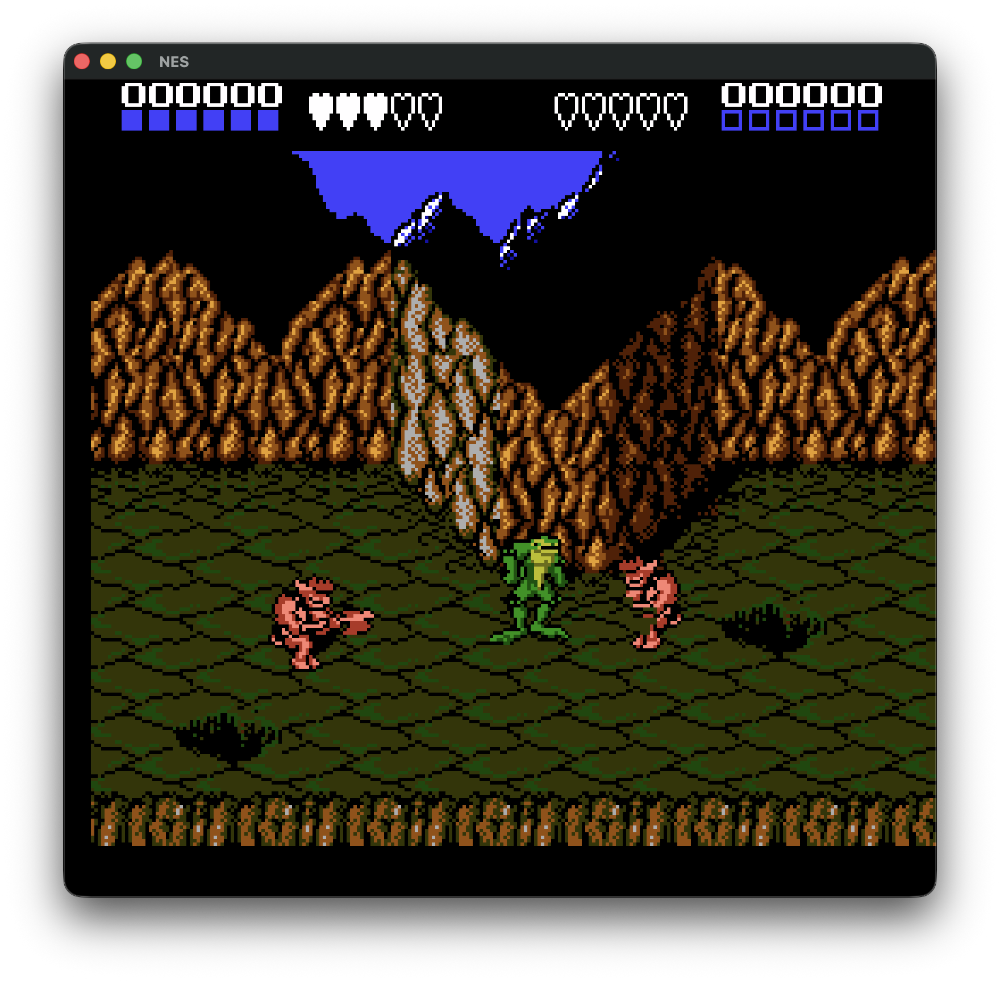
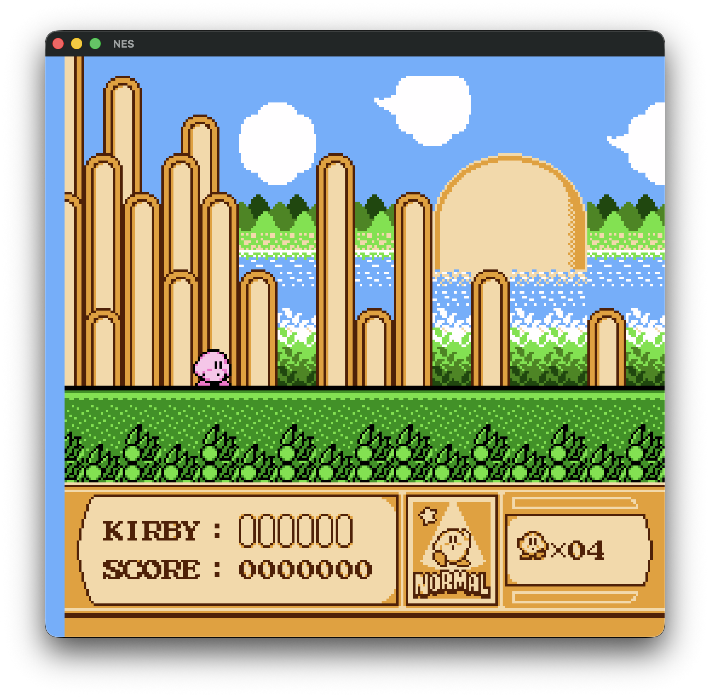
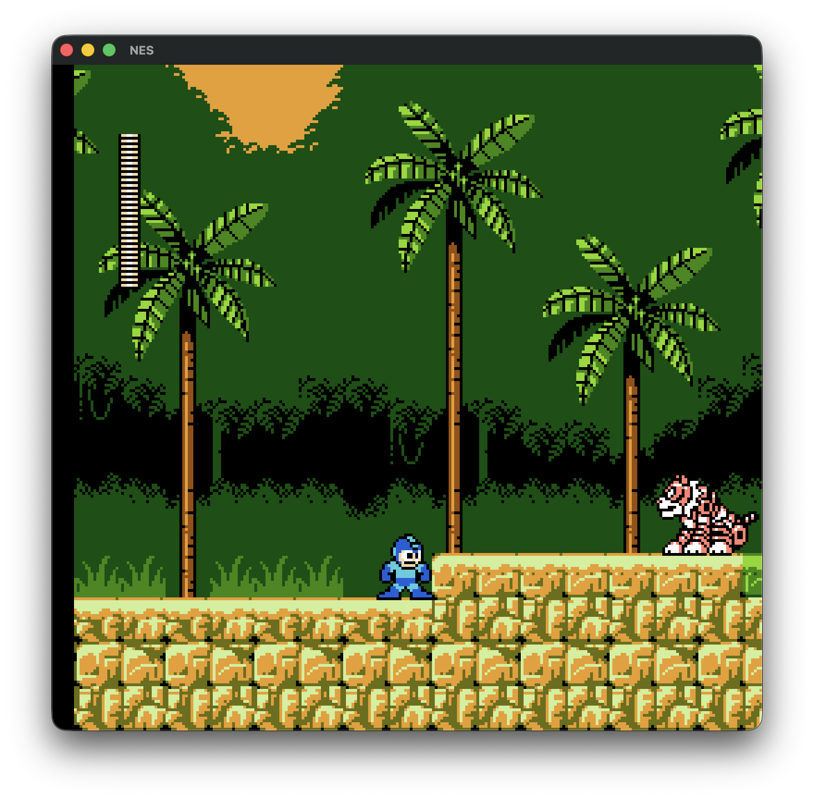
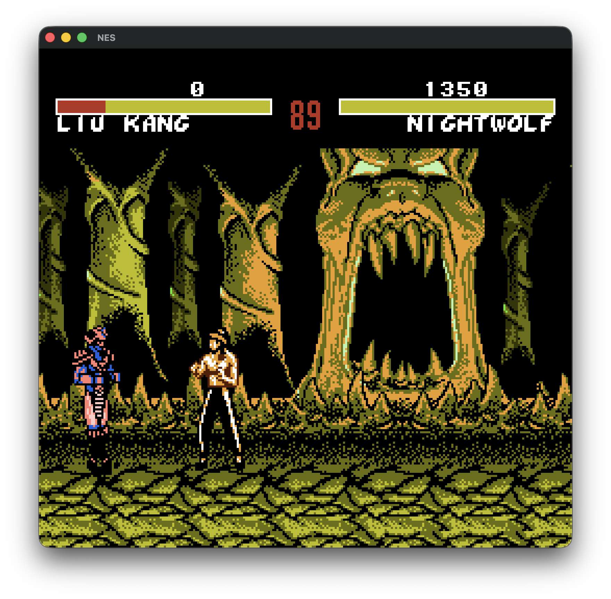
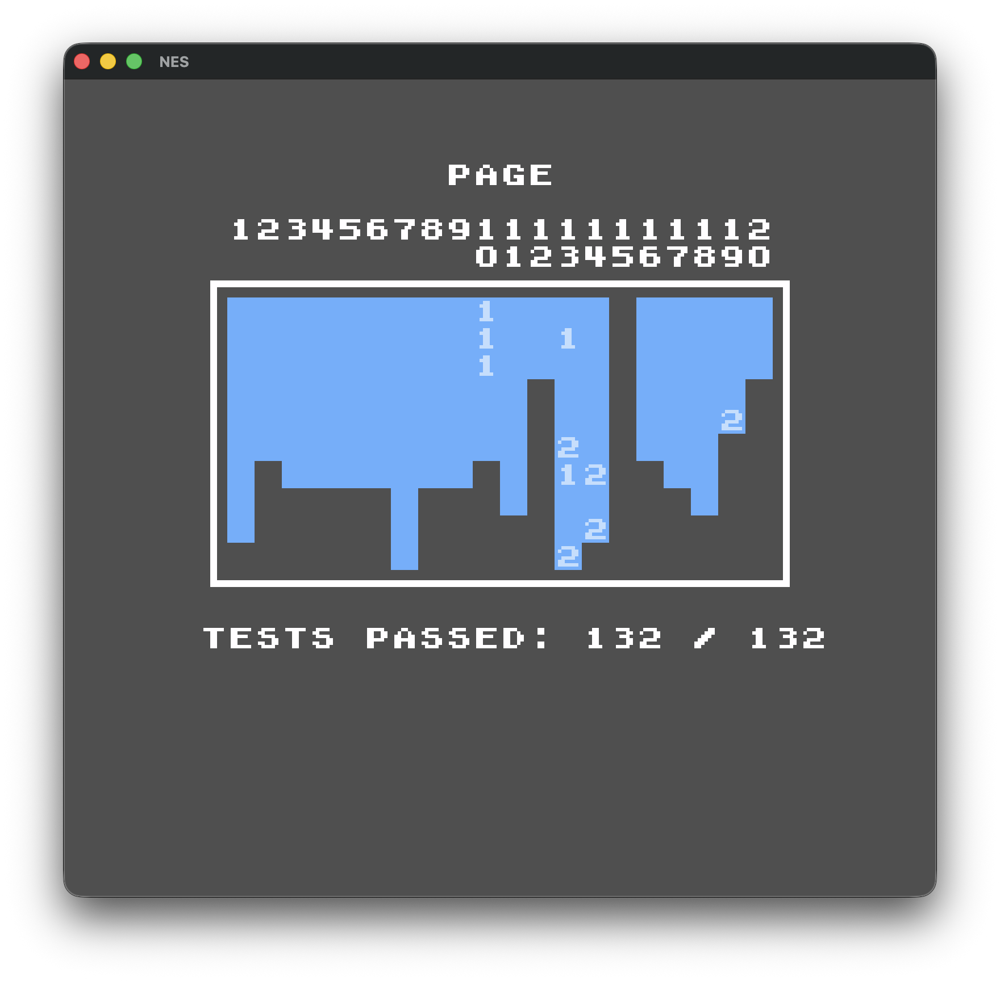

# NES

A cycle-accurate Nintendo Entertainment System emulator written from scratch in [Odin](https://odin-lang.org/), with SDL2 as its only dependency.

The CPU, PPU and APU are interleaved at the cycle level over a shared bus, so hardware quirks - open-bus reads, DMA contention, OAM corruption, interrupt hijacking, VBL race conditions - emerge from the structure of the emulation instead of being special-cased. It was built entirely from hardware documentation and test ROMs, without reference to existing emulators or AI.

~7,400 lines of Odin across CPU, PPU, APU, bus, mapper and audio-resampling code. It passes the standard NES test ROM suites, including [AccuracyCoin](https://github.com/100thCoin/AccuracyCoin) at **132/132**.

## Screenshots

| | |
|---|---|
|  |  |
| *Super Mario Bros.* (NROM) | *Contra* (UxROM) |
|  |  |
| *Battletoads* (AxROM) | *Kirby's Adventure* (MMC3) |
|  |  |
| *Mega Man 5* (MMC3) | *Mortal Kombat 4* (MMC3) |
|  | |
| *AccuracyCoin* - 132/132 | |

## What is emulated

- **CPU** - full cycle-stepped 6502. Each instruction is a handler advanced one cycle at a time, so every bus read and write lands on the correct cycle. All 151 official opcodes plus the illegal ones, including the unstable ones (`ANC`, `LAX`, `SHY`/`SHX`, `JAM`), and the dummy reads and writes on page crossings and read-modify-write instructions.
    - **Interrupts** - NMI edge detection, IRQ level detection, discrete polling points and interrupt hijacking.
    - **DMA** - OAM DMA and DMC DMA, including alignment cycles, the halt/wait cadence, concurrent DMA and explicit/implicit aborts.
- **Buses** - separate CPU and PPU address buses with full mirroring and open-bus behaviour: reads from unmapped addresses return the last value on the data bus, masked per region. APU registers are gated on the CPU's own address bus, reproducing the bus conflicts that occur when a DMA read overlaps them.
- **PPU** - dot-based renderer using the real background pipeline: nametable, attribute and pattern fetches into latches, then 16-bit shift registers with fine-X selection. Loopy `v`/`t`/`x`/`w` internal registers for scrolling, greyscale mode, and a 64-entry NTSC palette applied at the UI layer.
    - **Sprites** - evaluation over primary and secondary OAM with the sprite overflow bug, sprite 0 hit, 8×16 sprites, per-sprite X counters and OAM corruption.
    - **Edge cases** - odd-frame cycle skip, VBL set/clear suppression on `PPUSTATUS` reads, I/O bus decay, delayed rendering enable/disable after `PPUMASK` writes, and OAM reads during rendering.
- **APU** - all five channels (two pulse with sweep and envelope, triangle, noise LFSR, DMC), length counters, the triangle linear counter, and both 4- and 5-step frame counter modes with frame IRQ. DMC sample fetching drives real DMA on the CPU bus, so it steals cycles the way hardware does.
    - **Resampling** - output is generated at CPU rate and downsampled to 44.1 kHz through a band-limited **blip buffer** (a port of Blargg's approach) rather than naive averaging, avoiding the aliasing that makes simpler emulators sound harsh. Emulation is paced by SDL's audio queue (sync-to-audio emulation).
- **Mappers** - six, covering roughly 80% of the licensed library:
    - **NROM** (0), **UxROM** (2), **CNROM** (3)
    - **MMC1** (1) - serial shift register, PRG/CHR banking, PRG-RAM.
    - **MMC3** (4) - scanline IRQ counter driven by real PPU A12 edge detection, with the filtering delay.
    - **AxROM** (7) - single-screen mirroring.
- **Cartridges** - iNES and NES 2.0 header parsing. NTSC only; PAL and Dendy ROMs are rejected at load rather than mis-emulated.
- **Input** - controller ports modelled as a bus: two general-purpose ports plus the expansion port, with correct bit widths, open bus on the upper bits, and strobe timing that cannot fire on two consecutive cycles. The standard controller is implemented against a generic `Peripheral` interface.
- **Debug tooling** - compiled in only under `DEBUG_FEATURES=true`, so release builds pay nothing: real-time disassembly of executed instructions to a file, cycle-level trace logs toggleable at runtime, a breakpoint mode that single-steps whole instructions and dumps register state, and a tracking allocator that reports leaks and bad frees on exit.

## Accuracy

Validated against the standard NES test ROM suites - **all pass**, including **AccuracyCoin at 132/132**.

`nestest` and the 16 blargg `instr_test` singles run as automated tests via `make test`; the rest are ROMs run by hand.

| Area | Test suites | Status |
|------|-------------|--------|
| CPU | `nestest`, blargg `instr_test` singles (16) | ✅ automated |
| CPU | `instr_timing`, `cpu_interrupts_v2`, `cpu_reset` | ✅ |
| CPU | `cpu_dummy_reads`, `cpu_dummy_writes` | ✅ |
| PPU | `ppu_vbl_nmi` (11), `vbl_nmi_timing`, `nmi_sync` | ✅ |
| PPU | `ppu_sprite_hit` / `sprite_hit_tests` (11) | ✅ |
| PPU | `sprite_overflow_tests` | 4/5 |
| PPU | `oam_read`, `oam_stress`, `blargg_ppu_tests` | ✅ |
| APU | blargg APU suites, `test_apu_timers`, `test_apu_env`, `test_apu_sweep`, `test_tri_lin_ctr` | ✅ |
| APU | `sprdma_and_dmc_dma`, DMC DMA explicit/implicit stop | ✅ |
| Mappers | `mmc3_test_2`, `mmc1_a12`, `bntest_aorom`, `hellones` | ✅ |
| I/O | `read_joy3` | ✅ |
| System | `AccuracyCoin` | ✅ 132/132 |

**Known limitations:** NTSC only; colour emphasis bits are parsed but not applied; no battery-backed save persistence; no save states; only six mappers.

## Build & run

**Prerequisites:** the [Odin compiler](https://odin-lang.org/docs/install/) and SDL2.

```bash
make build
```

```bash
make run
```

Or run the binary directly with `./nes <path-to-rom>`.

### Controls

| Key | Action |
|-----|--------|
| Arrow keys | D-pad |
| <kbd>A</kbd> / <kbd>S</kbd> | A / B |
| <kbd>Z</kbd> / <kbd>X</kbd> | Select / Start |
| <kbd>M</kbd> | Mute |
| <kbd>Q</kbd> | Quit |
| <kbd>B</kbd> / <kbd>V</kbd> | Toggle breakpoint / step one instruction |
| <kbd>T</kbd> / <kbd>D</kbd> | Toggle tracing / disassembly (debug builds) |

## Appendix: mapper coverage

| Mapper    | Games |
| --------- | ----- |
| 1			| 661	|
| 4			| 573	|
| 2			| 262	|
| 0			| 243	|
| 3			| 151	|
| 7			| 76	|
| 206		| 42	|
| 19		| 32	|
| 11		| 31	|
| 5			| 23	|
| 79		| 16	|
| 66		| 16	|
| 16		| 15	|
| 69		| 15	|
| 18		| 15	|
| 71		| 12	|
| 9			| 11	|
| 23		| 10	|
| 33		| 9	    |
| 87		| 9	    |
| 185		| 8	    |
| 119		| 8	    |
| 80		| 7	    |
| 118		| 6	    |
| 25		| 6	    |
| 75		| 6	    |
| 32		| 6	    |
| 64		| 5	    |
| 68		| 4	    |
| 152		| 4	    |

| Mappers implemented   | Total coverage  |
| --------------------- | --------- |
| 5                     | 79.91%    |
| 10                    | 88.54%    |
| 15                    | 91.79%    |
| 20                    | 93.95%    |
| 25                    | 95.43%    |
| 30                    | 96.49%    |
